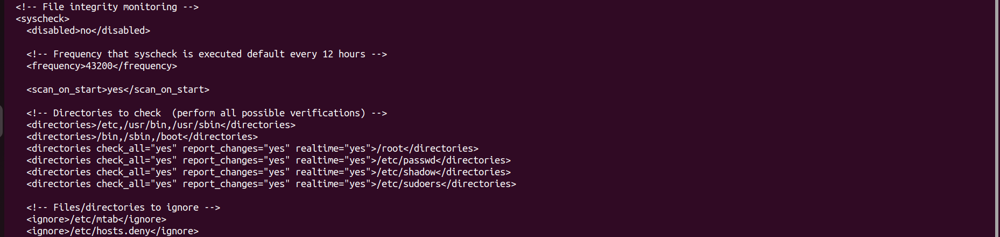
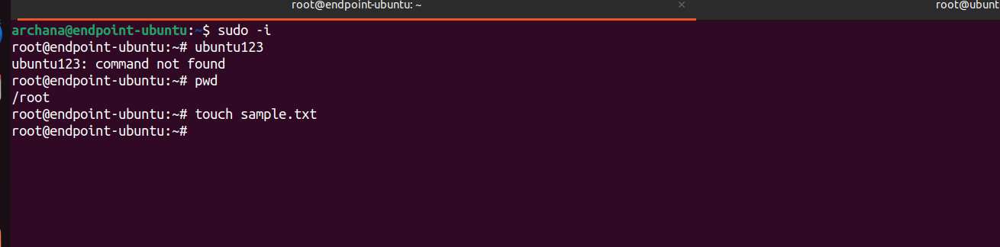
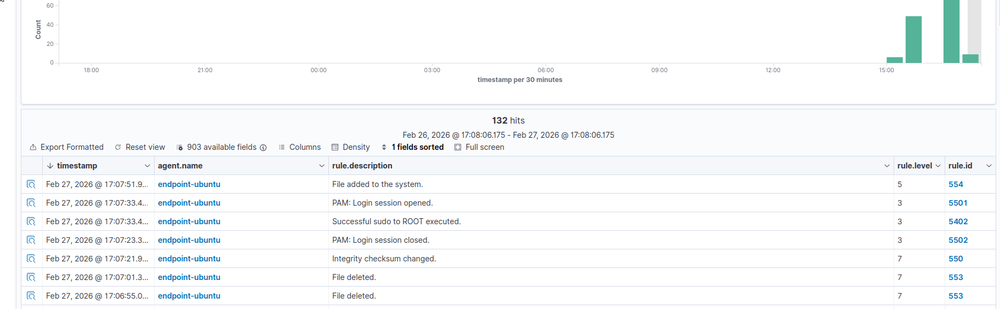
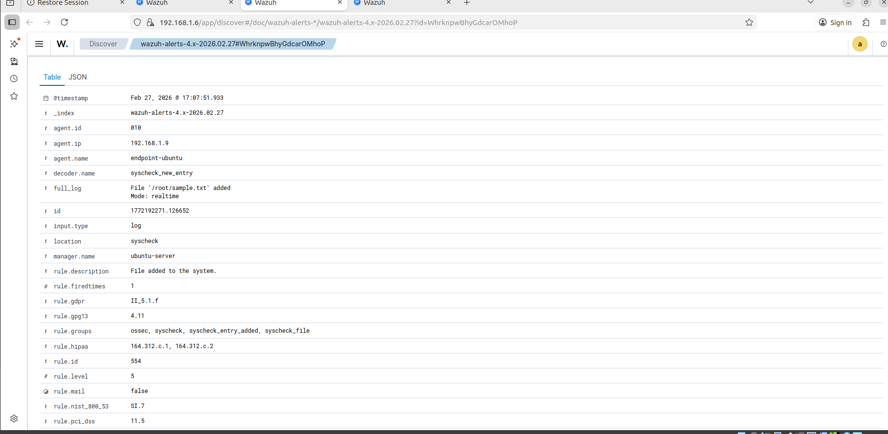

# File Integrity Monitoring

---

## Objective

Detect unauthorized file changes on a Linux system by monitoring critical directories using Wazuh File Integrity Monitoring (FIM). This use case demonstrates how SOC teams identify suspicious file activity and maintain system integrity.

---

## Environment

- Monitored Host: Ubuntu Endpoint (Wazuh Agent)
- SIEM Platform: Wazuh
- Detection Type: Host-based (File Integrity Monitoring)
- Attack Simulation: Manual file creation/modification
- Monitored Directories: /root, /etc, /usr/bin, etc.

---

## SOC Context

File Integrity Monitoring is essential for detecting unauthorized modifications, persistence mechanisms, and privilege escalation attempts. Attackers often modify critical system files to maintain access, making FIM a key SOC detection capability.

---

## Step 1: Configure FIM in Wazuh

Edit the Wazuh agent configuration file:

`/var/ossec/etc/ossec.conf`



## Step 2: Restart Wazuh Agent

Apply configuration changes:

``` sudo systemctl restart wazuh-agent```

## Step 3: Simulate File Activity

Create or modify a file on the monitored system:



## Step 4: Detection in Wazuh

Wazuh detects file changes in real-time and generates alerts.




## SOC Relevance

This use case demonstrates how Wazuh monitors critical system files and detects unauthorized modifications. FIM helps SOC teams identify potential compromise, persistence mechanisms, and insider threats, ensuring system integrity.

## Conclusion

File Integrity Monitoring using Wazuh provides real-time visibility into file system changes. By tracking modifications, creations, and deletions, SOC analysts can quickly detect suspicious activity and respond to potential security incidents.
