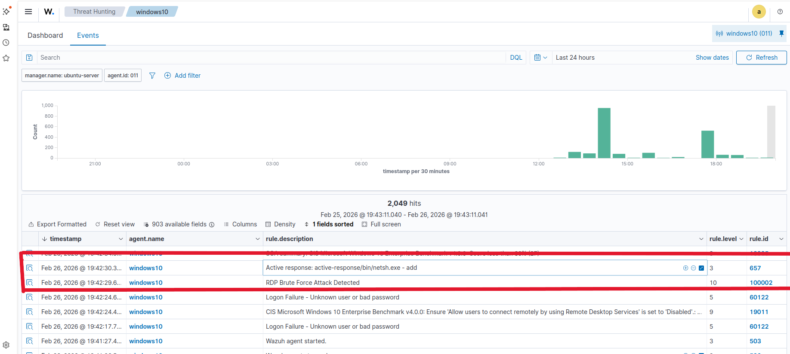
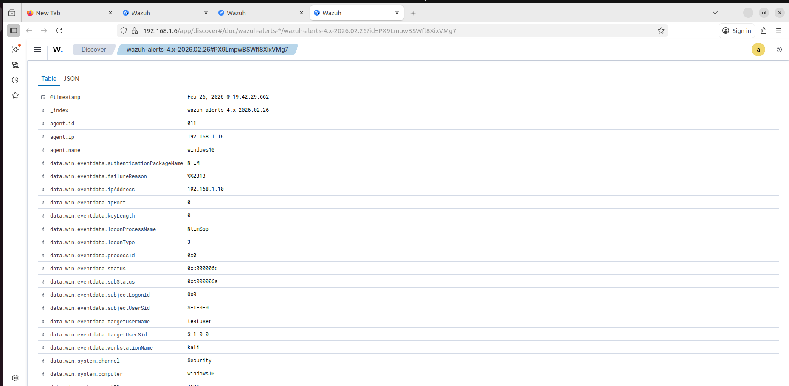

## UC1 – RDP Brute Force Detection and Blocking (Windows Endpoint)

### Objective
Detect and respond to RDP brute force attacks targeting a Windows system by monitoring repeated failed login attempts using Wazuh SIEM. This use case demonstrates how SOC teams identify credential access attempts and prevent unauthorized access.

---

### Environment
- **Wazuh Manager:** Ubuntu Server  
- **Target Machine:** Windows 10 (Wazuh Agent)  
- **Attacker Machine:** Kali Linux  
- **Detection Type:** Host-based (Windows Security Logs)  
- **Target Service:** RDP (Port 3389)  

---

### SOC Context
RDP brute force attacks are commonly used by attackers to gain initial access to Windows systems. Detecting repeated failed login attempts helps SOC teams identify credential-based attacks early and prevent unauthorized access.

---

## Step 1: Environment Verification

- Wazuh manager and agent are successfully connected
- Windows agent is actively sending logs to Wazuh
- All endpoints are visible in the dashboard


## Step 2: Attack Simulation (Kali Linux)

- Performed RDP brute force attack using Hydra
- Targeted Windows machine on port 3389
- Used multiple username/password combinations

**Command used:**

```bash
hydra -l testuser -P passwordlist.txt rdp://<WINDOWS_IP> -t 1 -W 3 -V
```

## Step 3: Detection in Wazuh

- Multiple failed login attempts detected from attacker machine
- Wazuh rule triggered: **60122**
- Alert generated: **Logon Failure - Unknown user or bad password**
- Repeated events indicate brute force activity
  


## Step 4: Active Response Configuration (IP Blocking)

To automatically block the attacker after detecting RDP brute force attempts, Wazuh Active Response is configured on the Windows endpoint.

---

### Rule Configuration

A custom rule is created to detect RDP brute force activity based on multiple failed login attempts.

**File:** `/var/ossec/etc/rules/local_rules.xml`

```xml
<group name="rdp, brute_force">

  <rule id="100300" level="10" frequency="3" timeframe="120">
    <if_matched_sid>60122</if_matched_sid>
    <description>RDP Brute Force Attack Detected</description>
  </rule>

</group>
```

- **60122** → Windows failed login event  
- Triggered when **3 failed attempts within 120 seconds**

---

### Active Response Configuration

Active response is configured to block the attacker IP using Windows Firewall.

**File:** `/var/ossec/etc/ossec.conf`

```xml
<active-response>
  <command>netsh</command>
  <location>local</location>
  <rules_id>100300</rules_id>
  <timeout>60</timeout>
</active-response>
```

- **netsh** → Used to modify Windows Firewall rules  
- **rules_id 100300** → Custom brute force rule  
- **timeout 60** → Block lasts for 60 seconds  

---

### Restart Wazuh Services

After making changes, restart the Wazuh manager:

```bash
sudo systemctl restart wazuh-manager
```
## Step 5: Attack Re-Simulation (Verify Blocking)

- Re-ran the RDP brute force attack from Kali Linux  
- Same target and credentials used as initial attack  
- Objective: Verify if active response blocks the attacker  

**Command used:**

```bash
hydra -l testuser -P passwordlist.txt rdp://<WINDOWS_IP> -t 1 -W 3 -V
```

- Connection attempts start failing  
- Indicates firewall rule is applied  
- Attacker is unable to continue brute force attack  

---

## Step 6: Active Response Verification

- Wazuh dashboard shows active response execution  
- Rule triggered: **RDP Brute Force Attack Detected**  
- Active response action executed using `netsh`  

  

- Source IP is automatically blocked  

